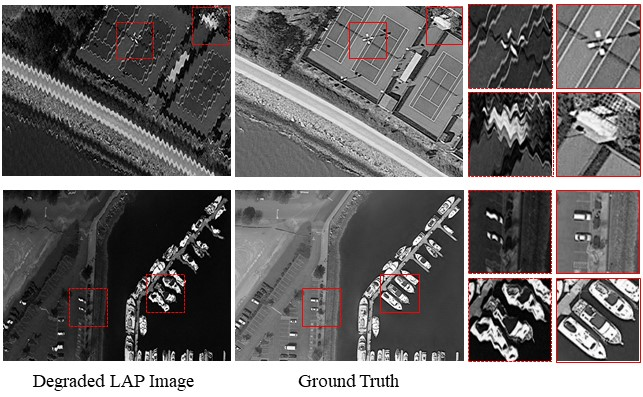
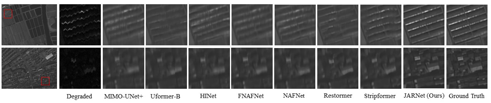
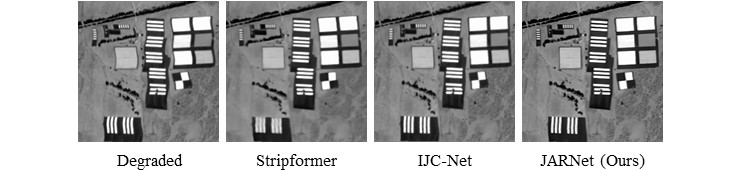

# Deep Linear Array Pushbroom Image Restoration: A Degradation Pipeline and Jitter-Aware Restoration Network
Zida Chen*, Ziran Zhang*, Haoying Li, Menghao Li, Yueting Chen, Qi Li, Huajun Feng, Zhihai Xu, Shiqi Chen

State Key Laboratory of Extreme Photonics and Instrumentation, Zhejiang University

## News
**2024.01.17** Our train/test code, LAP dataset and pre-trained model are available now.

**2023.12.09** Our paper is accepted by **AAAI 2024**! [Paper Link](https://arxiv.org/abs/2401.08171)

## Get Started
### Data Preparation

You can download our synthetic LAP [training](https://drive.google.com/file/d/1n8PHoG7RYrp3uvDU-5DXF4FFl_KHqZt1/view?usp=sharing) and [evaluation](https://drive.google.com/file/d/18hLBPKpbpSBRUpnRcM5zzZySyRurMk81/view?usp=sharing) dataset.

Please unzip them and config the dataset path in your config file (e.g. options/test_JARNet_LAP.yaml).

Note: You need to reserve at least **200GB** of disk space for storage of data.


### Environment

- Install the packages in your environment (python >= 3.7):
```
pip install -r requirements.txt
```

- Build up [BasicSR](https://github.com/XPixelGroup/BasicSR) environment by running:
```
python setup.py develop --no_cuda_ext
```

- To choose the gpu id, please modify the following code in the train/evaluation script:
```
os.environ["CUDA_VISIBLE_DEVICES"] = {your gpu id}
```

### Train

You can train the JARNet by using:
```
python basicsr/train_jarnet.py -opt options/train_JARNet_LAP.yml
```

You can train other restoration model (e.g. NAFNet) by using:
```
python basicsr/train_others.py -opt options/train_NAFNet_LAP.yml
```

You should fill out the path of the dataset in train config (i.e. yaml) file.

### Evaluation

You can evaluate the JARNet by using:
```
python basicsr/test.py -opt options/test_JARNet_LAP.yml
```

You should fill out the path of the dataset and pre-trained model in test config (i.e. yaml) file.

You can infer JARNet by the [pre-trained model](https://drive.google.com/file/d/1IjFgrXD4YBmRaWPX-WukgvzRdJHrZqZ6/view?usp=sharing) on our LAP evaluation dataset.

## Visualization Comparisons
### Samples of Synthetic LAP Dataset


### Synthetic LAP Image Restoration Results


### Real-World LAP Image Restoration Results


## Citation

If this repo helps you, please consider citing our work:

```
@inproceedings{chen2024deep,
  title={Deep Linear Array Pushbroom Image Restoration: A Degradation Pipeline and Jitter-Aware Restoration Network},
  author={Zida Chen and Ziran Zhang and Haoying Li and Menghao Li and Yueting Chen and Qi Li and Huajun Feng and Zhihai Xu and Shiqi Chen},
  booktitle={AAAI},
  year={2024}
}
```

## Contact
If you have any question, please contact zd_chen@zju.edu.cn.


## Acknowledgment
Our code is based on the [BasicSR](https://github.com/XPixelGroup/BasicSR) toolbox.